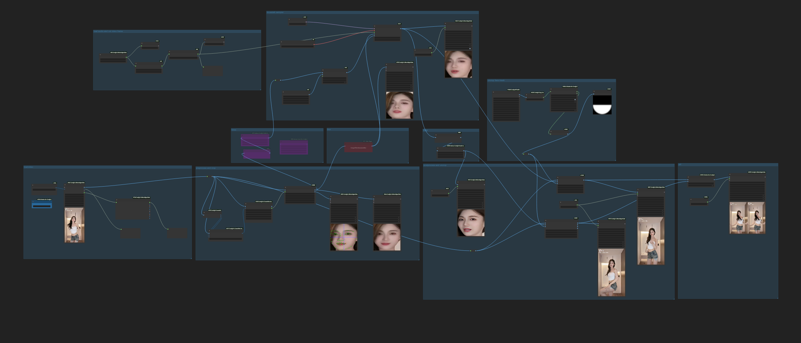
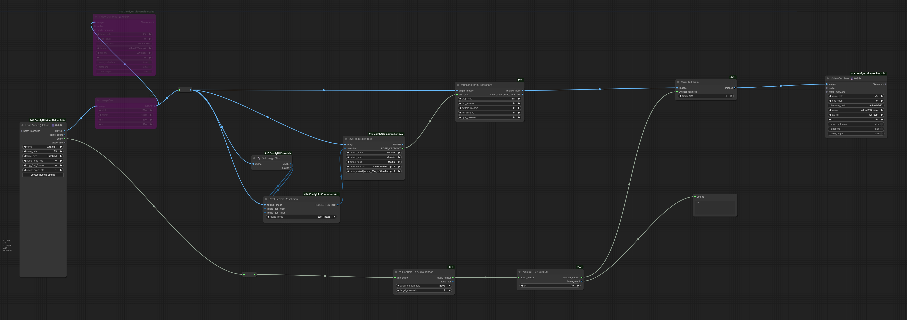

# MuseTalk ComfyUI Preprocess and Postprocess Nodes

# Preprocess Node
1. rotated image、crop face images

# Postprocess Node
1. uncrop faces and rotated images

# MuseTalk Work Flow
1. open musetalk flow and upload video(or image)
2. set audio path(wav or mp3 ...)
3. run the flow
4. video tutorial: 

5. GPU < 5G can run

# MuseTalk Train Work Flow
1. open train flow and upload video
2. run the train flow
3. `epoch_0.pth`、`epoch_1.pth`、`epoch_2.pth`... will gen into `models\musetalk\musetalk` folder
4. watch loss value in the cmd terminal, manual stop terminal when the training loss has decreased to 0.005 or lower
5. select musetalk model by `epoch_x.pth` in the musetalk flow.
6. run the musetalk flow for test.
7. the train flow just a demo for test.
8. GPU 16G can Run.

Original repo:
https://github.com/TMElyralab/MuseTalk